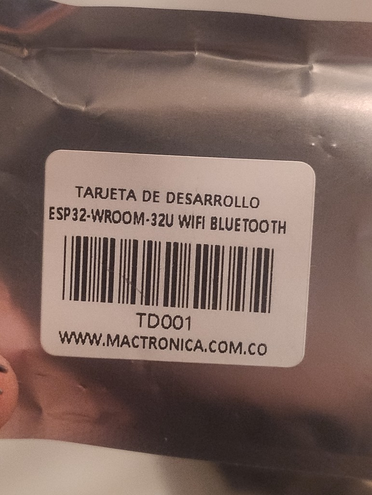
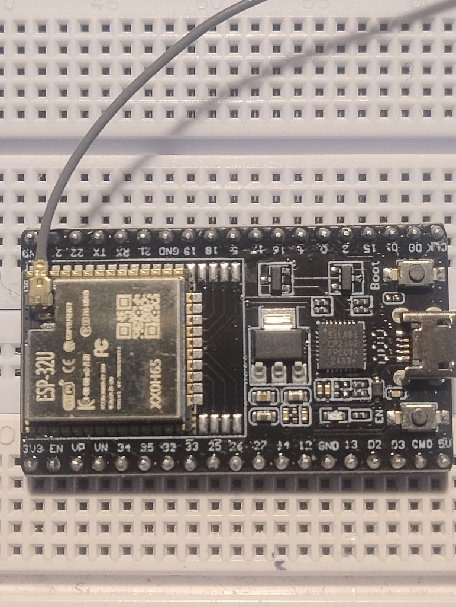
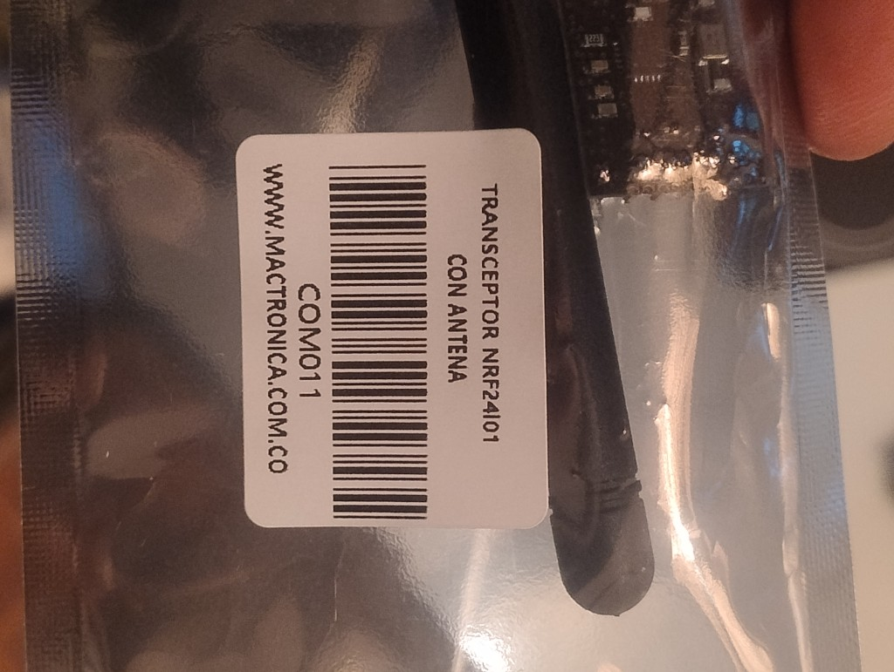
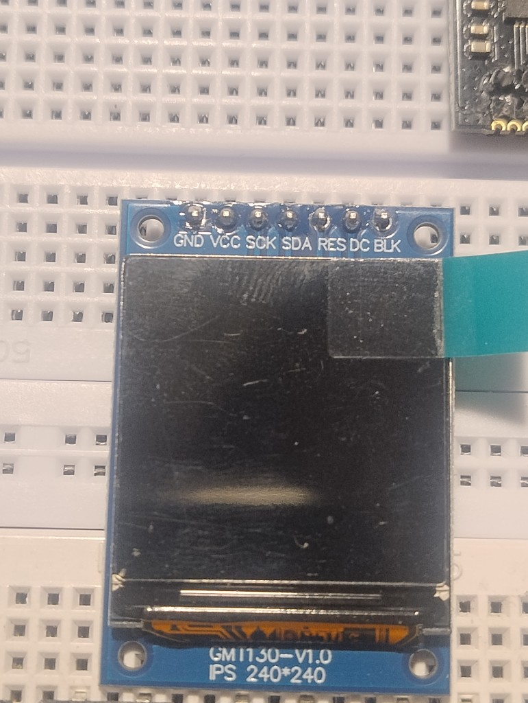

# nRFBox — Build personalizado (ESP32-WROOM-32U + 2× NRF24L01 + pantalla IPS ST7789)

Esta es una variante del firmware de nRFBox adaptada para usar:

| | Original del repo | Este build |
|---|---|---|
| MCU | ESP32 genérico | **ESP32-WROOM-32U** DevKit (CP2102, antena externa) |
| Radios | 3× NRF24L01 (A/B/C) | **2× NRF24L01 con antena** (A/B) |
| Pantalla | OLED SSD1306 128×64 I2C | **IPS GMT130 240×240 SPI (driver ST7789)**, sin pin CS |

> Firmware compilado y **verificado de extremo a extremo** con `arduino-cli` (core `esp32:esp32` v3.3.12), **flasheado sobre hardware real por USB**, y **confirmado visualmente** en la pantalla física (menú renderizado, escalado a pantalla completa). Ver sección [Estado de verificación](#estado-de-verificación-probado-en-hardware-real) al final.

---

## 1. Componentes usados

<table>
<tr>
<td width="50%">

**ESP32-WROOM-32U DevKit**
Módulo WROOM-32U (antena externa) sobre placa de desarrollo genérica con CP2102, botones BOOT/EN.




</td>
<td width="50%">

**2× Transceptor NRF24L01 con antena**
(Mactrónica, ref. COM011)



**Pantalla IPS GMT130 240×240 (ST7789)**
Pines: `GND VCC SCK SDA RES DC BLK` — **sin pin CS**.



</td>
</tr>
</table>

---

## 2. Por qué la pantalla va en un bus SPI separado

El panel GMT130 **no expone pin CS**: está soldado a GND dentro del módulo, por lo que el chip queda **siempre seleccionado**. Si comparte físicamente las líneas SCK/MOSI con el bus SPI de hardware que usan los dos NRF24 (GPIO18/19/23), cada transacción dirigida a un radio también sería interpretada como un comando por la pantalla (y viceversa), corrompiendo ambos buses.

**Solución:** la pantalla se maneja por un **SPI de software en pines completamente dedicados** (GPIO21/22), sin ningún punto de contacto eléctrico con el bus de los radios.

---

## 3. Mapa de pines completo (ESP32-WROOM-32U DevKit)

### 3.1 Alimentación (hacer primero)

| ESP32 | → |
|---|---|
| `3V3` | Riel (+) 3.3V del breadboard |
| `GND` | Riel (−) común — **todo** se referencia a este mismo GND |

> ⚠️ Pon un **capacitor de 10–100 µF** entre VCC y GND lo más cerca posible de **cada** NRF24 (2 capacitores en total). Sin esto, el jammer/scanner puede colgarse o reiniciar el ESP32 por caídas de tensión.

### 3.2 NRF24L01 — Radio A

| Pin del módulo | → | ESP32 (GPIO) |
|---|---|---|
| `GND` | → | GND |
| `VCC` | → | 3V3 (**no 5V**) |
| `CE` | → | **5** |
| `CSN` | → | **17** |
| `SCK` | → | **18** |
| `MOSI` | → | **23** |
| `MISO` | → | **19** |
| `IRQ` | → | sin conectar |

### 3.3 NRF24L01 — Radio B

| Pin del módulo | → | ESP32 (GPIO) |
|---|---|---|
| `GND` | → | GND |
| `VCC` | → | 3V3 |
| `CE` | → | **16** |
| `CSN` | → | **4** |
| `SCK` | → | **18** (mismo bus que Radio A) |
| `MOSI` | → | **23** (mismo bus) |
| `MISO` | → | **19** (mismo bus) |
| `IRQ` | → | sin conectar |

Los dos radios **comparten** SCK/MOSI/MISO (es el mismo bus SPI de hardware); solo `CE`/`CSN` son individuales por módulo. Es correcto y necesario que sea así.

### 3.4 Pantalla GMT130 / ST7789 — bus propio

| Pin de la pantalla | → | ESP32 (GPIO) |
|---|---|---|
| `GND` | → | GND |
| `VCC` | → | 3V3 |
| `SCK` | → | **22** |
| `SDA` (MOSI) | → | **21** |
| `RES` | → | **2** |
| `DC` | → | **15** |
| `BLK` | → | **13** |
| *(sin pin CS en el módulo)* | → | **12** ⚠️ ver nota |

> ⚠️ **GPIO12 no se conecta a nada físicamente.** El módulo no tiene pin CS real (está soldado a GND dentro de su propia placa), pero la librería `TFT_eSPI` necesita que le pasemos un número de GPIO válido para su lógica interna. GPIO12 queda libre y sin cablear — es puramente una formalidad de software, no afecta el cableado real.

### 3.5 Botones (5× pulsador momentáneo)

Van entre el GPIO y GND (el firmware usa `INPUT_PULLUP`, no se necesitan resistencias externas):

| Función | GPIO |
|---|---|
| UP | **26** |
| DOWN | **32** |
| SELECT | **33** |
| LEFT | **25** |
| RIGHT | **27** |

Conexión: `GPIO ──[botón]── GND`

### 3.6 NeoPixel (WS2812, opcional — indicador de estado)

| NeoPixel | → | ESP32 |
|---|---|---|
| `VCC` | → | 3V3 o 5V (según el módulo) |
| `GND` | → | GND |
| `DIN` | → | **14** |

### 3.7 Tarjeta SD (opcional — solo para "Update Firmware" desde el menú Settings)

| SD | → | ESP32 |
|---|---|---|
| `CS` | → | **5** (⚠️ mismo pin que `CE` del Radio A — diseño heredado del proyecto original; solo usa la SD cuando no estés usando el Radio A al mismo tiempo) |

---

## 4. Componentes pasivos (BOM)

Lista de capacitores/resistores necesarios, con su propósito y dónde van. Ninguno es parte del firmware — son protección/filtrado de hardware.

| # | Componente | Valor | Dónde | Obligatorio? | Por qué |
|---|---|---|---|---|---|
| 2 | Capacitor electrolítico (o tantalio) | **10–100 µF** (16V o 25V, cualquiera sirve a 3.3V) | Entre `VCC` y `GND` de **cada NRF24**, lo más pegado posible al pin del módulo | ✅ Sí | Los NRF24 tienen picos de corriente muy rápidos al transmitir (hasta ~115 mA en `PA_MAX`). Sin este capacitor, el voltaje cae momentáneamente y el radio se reinicia o deja de responder — es la causa #1 de que un NRF24 "no funcione" en el ESP32. |
| 2 | Capacitor cerámico | **100 nF (0.1 µF)** | En paralelo con el electrolítico de arriba, en cada NRF24 (mismo VCC/GND) | 👍 Recomendado | El electrolítico filtra caídas lentas; el cerámico filtra ruido de alta frecuencia que el electrolítico no alcanza a absorber. Combo clásico. |
| 1 | Capacitor electrolítico | **220–470 µF** | Entre el riel 3.3V y GND del breadboard, cerca de donde sale del ESP32 (capacitor "de bulto" para toda la placa) | 👍 Recomendado | Con 2 radios + pantalla + NeoPixel tirando corriente a la vez (sobre todo en modo Jammer), este capacitor amortigua la demanda conjunta antes de que llegue a cada módulo individual. |
| 1 | Resistor | **300–470 Ω** | En serie, entre el pin `DIN` del ESP32 (GPIO14) y la entrada `DIN` del NeoPixel | 👍 Recomendado (solo si usas el NeoPixel) | Protege la entrada de datos del NeoPixel de picos de voltaje al encender; práctica estándar de Adafruit para cualquier WS2812. |
| 1 | Capacitor electrolítico | **100–470 µF** | Entre `VCC` y `GND` del NeoPixel, lo más cerca posible del propio LED | 👍 Recomendado (solo si usas el NeoPixel) | Mismo motivo que los NRF24: absorbe el pico de corriente al cambiar de color. |
| — | Resistor en BLK de la pantalla | — | — | ⚠️ Revisar | La mayoría de módulos GMT130/ST7789 ya traen su propia resistencia limitadora para el backlight soldada en la placa. Antes de conectar `BLK` directo al GPIO13, revisa que no sea un LED "pelado" sin resistencia — si lo es, agrega una de **100–220 Ω** en serie. |
| — | Resistores para botones | — | — | ❌ No se necesitan | El firmware configura los 5 botones con `INPUT_PULLUP` interno del ESP32, así que van directo `GPIO → botón → GND`, sin resistencia externa. |

### Resumen de compra mínimo

```text
2x  Electrolítico 10-100 µF   (uno por NRF24)
2x  Cerámico 100 nF           (uno por NRF24, opcional pero recomendado)
1x  Electrolítico 220-470 µF  (riel principal 3.3V, recomendado)
--- Solo si usas NeoPixel ---
1x  Resistor 300-470 Ω
1x  Electrolítico 100-470 µF
```

Con esto cubres lo esencial (4 capacitores) más lo recomendado para el NeoPixel si lo vas a usar. El voltaje de los electrolíticos no es crítico aquí — cualquiera de 10V o más sirve de sobra para un circuito de 3.3V.

---

## 5. Resumen de todos los GPIO usados

```text
Botones:      26(UP)  32(DOWN)  33(SELECT)  25(LEFT)  27(RIGHT)
NRF24 A:      CE=5    CSN=17
NRF24 B:      CE=16   CSN=4
Bus SPI radios (compartido A+B):  SCK=18  MOSI=23  MISO=19
Pantalla:     SCK=22  MOSI=21  RES=2  DC=15  BLK=13
NeoPixel:     DIN=14
SD (opcional): CS=5  (comparte con CE de Radio A)
```

Ningún pin se repite entre componentes, salvo el caso ya documentado de `SD_CS`/`CE` del Radio A.

---

## 6. Librerías de Arduino necesarias

Instalar desde el **Gestor de Librerías** del IDE (o `arduino-cli lib install`):

| Librería | Versión verificada |
|---|---|
| RF24 (TMRh20) | 1.6.2 |
| Adafruit NeoPixel | 1.15.5 |
| Adafruit GFX Library | 1.12.6 (solo como clase base del adaptador, ver sección 8) |
| **TFT_eSPI** (Bodmer) | **2.5.43** |
| U8g2_for_Adafruit_GFX | 1.8.0 |

> **Nota:** este build usa `TFT_eSPI`, **no** `Adafruit_ST7735_and_ST7789_Library`. En pruebas reales sobre hardware, la ruta de SPI por software (bit-banged) de `Adafruit_ST7789` compiló y corrió sin ningún error, pero no mostraba absolutamente nada en el panel físico (solo encendía el backlight). `TFT_eSPI`, que usa el periférico SPI por hardware del ESP32, funcionó de inmediato con el mismo cableado. Ver el comentario al inicio de `display_compat.h` para el detalle completo del diagnóstico.

## 7. Configuración de la tarjeta en Arduino IDE

- **Gestor de Tarjetas:** `esp32` by Espressif Systems — **v3.3.12** (o posterior dentro de la serie 3.x)
- **Board:** `ESP32 Dev Module`
- **Partition Scheme:** **`Minimal SPIFFS (1.9MB APP with OTA/128KB SPIFFS)`**
  — el sketch pesa ~1.82 MB; el esquema por defecto (1.2 MB) no alcanza.
- Resto de opciones: valores por defecto.

---

## 8. Qué cambió en el código (resumen)

| Archivo | Cambio |
|---|---|
| `display_compat.h` | **Nuevo.** Clase `U8g2Compat` que replica la API de `u8g2` (`clearBuffer`, `drawStr`, `print`, `drawXBMP`, etc.) pero dibuja sobre `TFT_eSPI` + `U8g2_for_Adafruit_GFX`. Como `TFT_eSPI` no hereda de `Adafruit_GFX` (solo de `Print`), incluye una clase puente (`TftGfxBridge`) que adapta la interfaz. El lienzo lógico sigue siendo 128×64 (igual que el original, así que ningún ícono/menú existente se rompe) pero ahora se **escala** (nearest-neighbour, uniforme en X/Y para no deformar íconos) para ocupar el panel 240×240 lo más grande posible sin estirar, y se centra. |
| `tft_setup.h` | **Nuevo.** Configuración de pines/driver de `TFT_eSPI` en tiempo de compilación (la librería lo detecta automáticamente por estar en la carpeta del sketch). Define el driver ST7789, los pines reales, el pin CS "dummy" (ver sección 3.4) y fuerza el periférico HSPI para no chocar con el bus VSPI de los radios. |
| `config.h` | Pines actualizados, se quitó el radio C, se agregó la pantalla nueva. |
| `setting.h` / `setting.cpp` | Se quitó `RadioC`/`setupRadioC`. Las definiciones de `u8g2`, `pixels`, `neoPixelActive` y `oledBrightness` se centralizaron en `setting.cpp` (antes vivían como definiciones directas en un header incluido por 6 archivos `.cpp` distintos, lo que viola la regla de una sola definición y provoca errores de enlazado `duplicate symbol`/`multiple definition` con toolchains modernos). |
| `ism.cpp` | Se eliminó `RadioC` de `ProtoKill` y `Jammer` (ahora usan 2 radios en vez de 3). |
| `bluetooth.cpp` | Se eliminó `RadioC` de `BleJammer`. Se corrigieron llamadas a la API de BLE (`BLEScanResults` ahora es puntero, `addData`/`addServiceUUID` cambiaron de firma) para compatibilidad con el core ESP32 3.3.12. |
| `wifi.cpp` | Se quitó la redefinición local de `ieee80211_raw_frame_sanity_check()` — el core moderno ya la trae en `libnet80211.a` y chocaba con la del sketch. |
| `nRFBox.ino` | Sin cambios — funciona automáticamente gracias al shim de pantalla. |

---

## 9. Limitaciones conocidas / pendientes a tu criterio

- **Resolución de la UI:** el menú se dibuja en una ventana lógica de 128×64, escalada de forma **uniforme** (misma proporción en X e Y, para no deformar íconos) hasta ocupar el ancho completo del panel de 240×240; como 64×escala < 240, queda un margen negro arriba y abajo (en vez de a los lados). Rediseñar cada pantalla pixel por pixel para usar los 240×240 completos con una escala no-uniforme (estirando distinto en X y en Y) seguiría siendo posible pero deformaría íconos circulares en óvalos — no se hizo por eso.
- **Rotación:** si el contenido sale al revés o espejado, ajusta `#define TFT_ROTATION` (valores 0–3) en `display_compat.h`.
- **Brillo (BLK):** por defecto se controla por PWM desde GPIO13. Si prefieres simplicidad, puedes cablear `BLK` directo a 3V3 (pierdes el control de brillo del menú Settings).
- **2 radios en vez de 3 — auditado a fondo, sin pérdida real de funcionalidad:** se revisó línea por línea la lógica de `ProtoKill`/`blackout`, `Jammer` y `BleJammer` (los únicos 3 features que originalmente usaban el radio C). En los tres casos, el jamming **activo** siempre sincroniza todos los radios al **mismo canal** a la vez (`RadioA.setChannel(ch); RadioB.setChannel(ch);` …). Los arrays `channelGroup_1/2/3` (que sí asignaban canales distintos por radio) solo se usan una vez, de forma transitoria, al inicializar el modo — nunca durante el jamming activo. Conclusión: **el tercer radio nunca aportaba más canales cubiertos simultáneamente**, solo más potencia de transmisión redundante en el mismo canal. Con 2 radios se mantiene el 100% de las funciones del menú (ver tabla abajo); la única diferencia real es algo menos de potencia RF agregada durante el jamming.

  | Función | ¿Usa NRF24? | Radios usados | Efecto de 2 vs 3 |
  |---|---|---|---|
  | Scanner / Analyzer | Sí | Solo A | Ninguno (B/C nunca se usaron aquí) |
  | WLAN Jammer / Proto Kill / BLE Jammer | Sí | A+B | Ninguno en cobertura — solo ~33% menos potencia agregada en el mismo canal |
  | BLE Spoofer / Sour Apple / BLE Scan | No (BLE nativo del ESP32) | — | Ninguno |
  | WiFi Scan / Deauther | No (WiFi nativo del ESP32) | — | Ninguno |
  | About / Setting | No | — | Ninguno |

---

## Estado de verificación (probado en hardware real)

- ✅ Compilación limpia con `arduino-cli` + core `esp32:esp32@3.3.12` (93% de uso de flash con `min_spiffs`).
- ✅ Flasheo por USB verificado por hash contra una placa ESP32-WROOM-32 real (`ESP32-D0WD-V3`, detectada vía `/dev/cu.usbserial-0001`).
- ✅ **Pantalla confirmada visualmente funcionando** sobre hardware real: menú principal renderizado correctamente, escalado a pantalla casi completa.
- ⚠️ Pendiente de confirmación visual: que los 2 NRF24 respondan correctamente una vez cableados (Scanner/Analyzer/Jammer/etc.) — la pantalla y los radios se probaron por separado hasta ahora.

### Diagnóstico de pantalla en blanco (para referencia futura)

Si alguna vez la pantalla enciende el backlight pero no muestra nada:

1. Esto **ya nos pasó** en este mismo build usando `Adafruit_GFX` + `Adafruit_ST7789` (SPI por software/bit-banged): compilaba y corría sin ningún error, pero no dibujaba nada en el panel físico.
2. Se diagnosticó con sketches mínimos aislados (sin radios/botones) que confirmaron, por Serial, que el código llegaba hasta el final sin colgarse — descartando wiring y lógica de firmware como causa raíz.
3. La causa real era la propia librería/ruta SPI. La solución fue migrar a `TFT_eSPI` (SPI por hardware vía el periférico HSPI del ESP32), **con el mismo cableado físico**, lo cual funcionó de inmediato.
4. Si en el futuro se quisiera volver a `Adafruit_GFX` (por ejemplo por tamaño de flash), probar primero con un pin CS real conectado a un GPIO libre en vez de `-1`, como workaround conocido para variantes de esta librería en ESP32.
